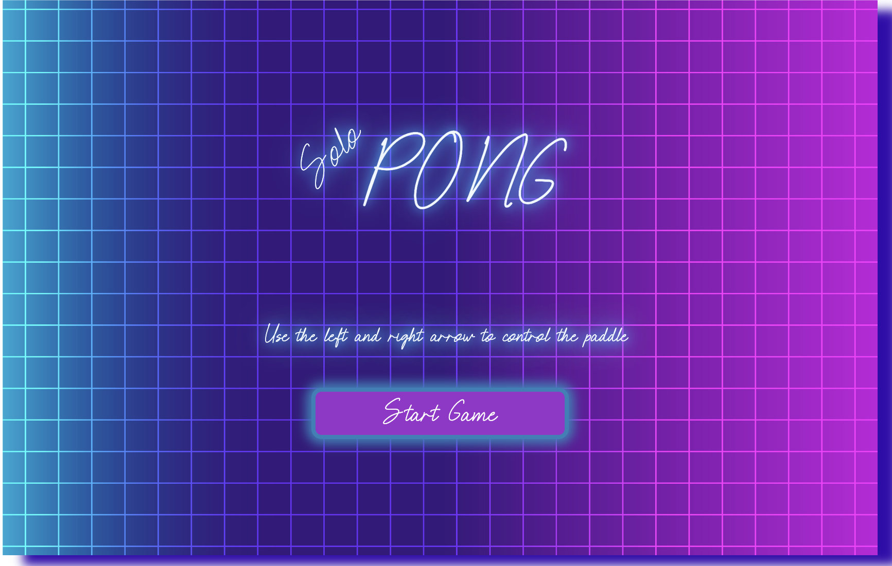
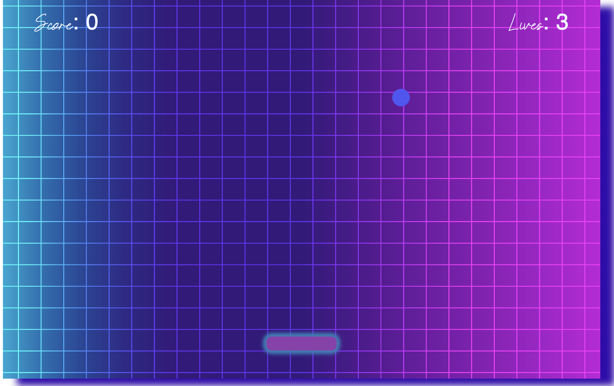

# Solo Pong

## [Play the Game!](https://hristinagjo.github.io/Solo-Pong/)

# Overall vision

I draw inspiration from the classic Arcade game Pong and made my own version of it “Solo Pong" for a single player. 
Solo Pong is a game where the player should keep the ball bouncing, earn points by colliding with the paddle, and prevent the ball from reaching the bottom of the screen to avoid losing lives. 
The challenge increases as the paddle's width reduces with each successful collision, making it progressively harder to control the ball. The player wins when he manage to lose all the width of the paddle.

## Main Functionalities 

- In the game screen the ball starts to move automatically within the board in direction X and Y 
- The player can move the paddle horizontally using the 'left' and 'right' arrow key in order to catch the ball
- The player starts with 0 scores and 3 lives

## Dynamics

- Every time the player hits the ball:
    - automaticlly ears a score of 10 points 
    - the paddle automatically loses of its width to make the game more challenging

- When the player misses the ball:
    - automaticlly loses a life
    - the new ball starts from a random position and the game continues

## Win or Lose logic

- The player wins once the width of the paddle is 0
- The player loses once the life of the player is 0

- Once the game is over the player is lead to the game over screen where a massage is shown depending of the outcome ("Congratulations: You won!", or "You lost") of the game. 
- On the game over screen the player has the choice to start the game again from the begging with clicking on the restart game button.

## Backlog Functionalities

- Add the stats (score:0 and lifes:3) on the start game screen 
- Add the stats with the outcome of the game on the end screen
- Animate some movement on the paddle once it hits the ball
- Add glowing effect on the ball
- Manipulate the speed of the ball as the player progresses
- Add delay for the appearence of the new ball once the player loses a life
- Add a sound on/off button

## Aesthetics

 Drawing inspiration from the simplicity and engaging gameplay of the classic Pong, I wanted to introduce a modern twist by incorporating the vibes of Synthwave style. The visuals pop with vivid colors, and the game elements—fonts, buttons, and paddles—are neonlit, creating a vibrant and stylish atmosphere.

 
 

# Technologies Used

- HTML
- CSS
- JavaScript
- DOM Manipulation
- JS Classes
- Local Storage
- JS Audio() and JS Button()

# States

- Start Screen
- Game Screen
- Game Over Screen

# Extra Links 

### Slides
[Link](https://docs.google.com/presentation/d/1n4_Vlz_AvijCcwMiHBSDS7B4LQWTxJJxH3PHquQ5-h4/edit?usp=drive_link)

## Repo
[Link](https://github.com/HristinaGjo/Solo-Pong)